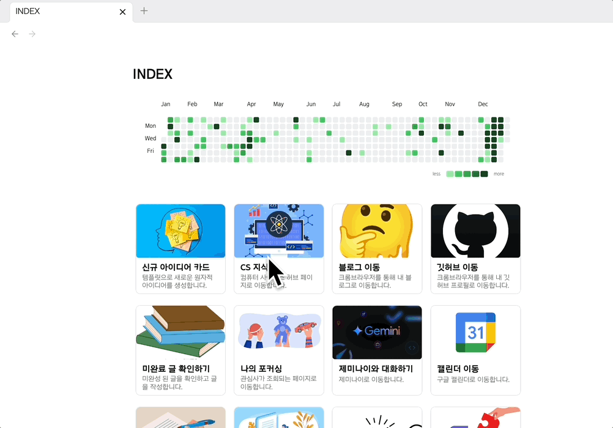
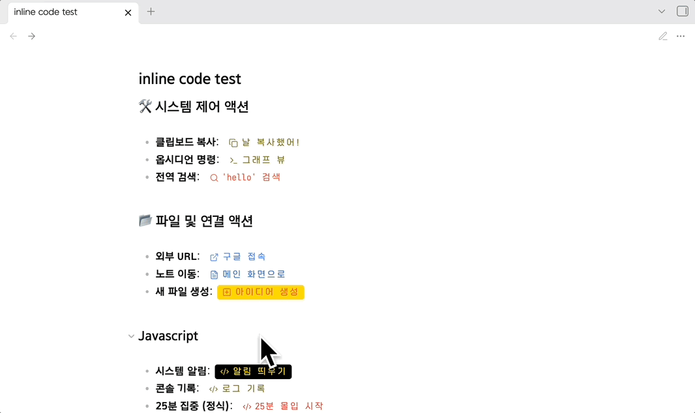
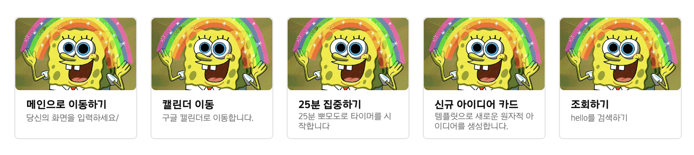
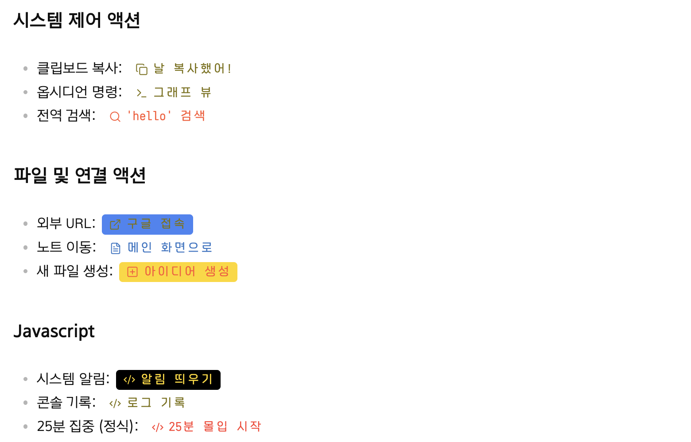

# with buttons

이 플러그인은 옵시디언(Obsidian) 내에서 강력한 카드형 대시보드와 본문 어디서든 동작하는 인라인 액션 버튼을 생성하기 위해 설계되었습니다.

## 주요 특징 (Key Features)

* 카드형 대시보드: 코드 블록 문법을 사용하여 한 줄로 정렬된 고정 비율 카드를 생성.


* 인라인 액션 버튼: 본문 텍스트 내에서 백틱(Backticks)을 사용하여 즉시 실행 가능한 버튼 생성.



* 다양한 액션 통합: 복사, 명령어 실행, URL 이동, 파일 생성, 검색, JS 실행 등 7가지 이상의 기능을 지원.


## 사용 방법 (Usage)

### 1. 카드 대시보드 (Card Dashboard)

`card-buttons` 코드 블록을 사용하여 대시보드를 구축합니다.

```card-buttons
[setting]
Ratio | 16:9   // 카드의 가로세로 비율 설정
img_ratio|70 // 이미지와 글자 비율 설정
style|theme_1 // 버튼 그룹 커스텀 스타일 설정
title-size|10 // title size
desc-size|8 // description size

[card]
title: 그래프 뷰 열기
desc: 옵시디언의 전체 연결망을 확인합니다.
picture: attachments/graph_banner.png | only  // |only 사용 시 사진만 꽉 차게 표시
action: command | graph:open
```


* [setting]: `Ratio` 값을 통해 카드의 비율을 조절하며, 카드는 넣은 개수만큼 한 줄로 자동 정렬됩니다.
* [setting]: `img_ratio` 값을 통해 카드 내 이미지의 비율을 조절합니다.
* [setting]: `style` 값을 통해 설정 화면에서 커스텀한 CSS를 해당 버튼 그룹에 반영합니다.
* [setting]: `title-size`, `desc-size` 값을 통해 카드 정보의 타이틀과 설명 란의 폰트 사이즈를 조절합니다.
* [card]: 개별 카드를 정의하며 `title`, `desc`, `picture`, `action` 필드를 가집니다.

---

### 2. 인라인 액션 버튼 (Inline Buttons)

텍스트 본문 내에서 `[!타입 | 라벨 | 값 | 아이콘색 | 배경색!]` 문법을 사용합니다.

* 기본형: ``[!copy|이메일 복사|master@world.com!]`` (라벨과 실행값 분리)
* 디자인 커스텀: ``[!url|네이버|naver.com|#ffffff|#03C75A!]`` (아이콘/글자색 및 배경색 지정)
* 아이콘 직접 지정: 타입 부분에 `github` 등 Lucide 아이콘 이름을 직접 입력할 수 있습니다.

---

## 3. 지원하는 액션 타입 (Action Types)

###  3.1 action 타입 및 예시 가이드 (card-buttons)

각 액션은 `|` 구분자를 통해 타입과 값을 분리하여 정의합니다.

1. **copy (클립보드 복사)**
* **설명**: 지정한 텍스트를 시스템 클립보드에 즉시 복사합니다.
* **형식**: `copy | 복사할 내용`
* **예시**: `copy | 안녕하세요, 반갑습니다!`


2. **command (명령어 실행)**
* **설명**: 옵시디언의 내부 명령어(Command Palette)를 ID를 통해 실행합니다.
* **형식**: `command | 명령어 ID`
* **예시**: `command | graph:open` (그래프 뷰 열기)


3. **url (웹/앱 링크 열기)**
* **설명**: 데스크탑에서는 브라우저를, 모바일에서는 설정된 스킴이 있다면 해당 앱을 실행합니다.
* **형식**: `url | 데스크탑 주소 | 모바일 앱 스킴(선택)`
* **예시**: `url | https://calendar.google.com | googlecalendar://`


4. **open (내부 파일 연결)**
* **설명**: 옵시디언 Vault 내의 특정 파일을 즉시 엽니다.
* **형식**: `open | 파일 경로`
* **예시**: `open | INDEX.md` 또는 `open | folder/work-log.md`


5. **search (전역 검색)**
* **설명**: 입력한 검색어로 옵시디언 전역 검색창을 활성화합니다.
* **형식**: `search | 검색어`
* **예시**: `search | #todo` (할 일 태그 검색)


6. **create (새 파일 생성)**
* **설명**: 지정된 템플릿 파일을 사용하여 새로운 노트를 생성합니다.
* **형식**: `create | 템플릿 파일 경로`
* **예시**: `create | templates/daily-note.md`


7. **js (자바스크립트 실행)**
* **설명**: 인라인으로 작성된 커스텀 자바스크립트 코드를 즉시 실행합니다.
* **형식**: `js | 실행할 코드`
* **예시**: `js | new Notice("성공적으로 실행되었습니다!")`

### 3.2 action 타입 및 예시 가이드 (inline-button)

모든 인라인 버튼은 `|` 구분자를 사용하며, 뒤쪽의 색상 설정은 선택 사항입니다.

1. **copy (텍스트 복사)**
* **설명**: 클릭 시 지정한 내용을 클립보드에 담습니다.
* **형식**: `[!copy | 버튼이름 | 복사할텍스트!]`
* **예시**: `[!copy | 이메일 복사 | master@world.com!]`


2. **command (명령어 실행)**
* **설명**: 옵시디언 내부 명령어를 실행합니다.
* **형식**: `[!command | 버튼이름 | 명령어ID!]`
* **예시**: `[!command | 그래프 보기 | graph:open!]`


3. **url (웹 및 앱 실행)**
* **설명**: 브라우저를 열거나 모바일 앱 스킴을 호출합니다.
* **형식**: `[!url | 버튼이름 | 데스크탑주소 | 모바일스킴!]`
* **예시**: `[!url | 캘린더 | https://calendar.google.com | googlecalendar://!]`


4. **open (파일 열기)**
* **설명**: 금고 내 특정 파일을 즉시 탐색합니다.
* **형식**: `[!open | 버튼이름 | 파일경로!]`
* **예시**: `[!open | 인덱스로 이동 | INDEX.md!]`


5. **search (검색 실행)**
* **설명**: 전역 검색창에 키워드를 입력하고 실행합니다.
* **형식**: `[!search | 버튼이름 | 검색어!]`
* **예시**: `[!search | 할 일 찾기 | #todo!]`


6. **create (새 파일 생성)**
* **설명**: 템플릿을 기반으로 새 노트를 만듭니다.
* **형식**: `[!create | 버튼이름 | 템플릿경로!]`
* **예시**: `[!create | 일기 쓰기 | templates/daily.md!]`


7. **js (스크립트 실행)**
* **설명**: 커스텀 자바스크립트를 즉시 실행합니다.
* **형식**: `[!js | 버튼이름 | 자바스크립트코드!]`
* **예시**: `[!js | 안녕 | new Notice("주인님 반갑습니다!")!]`

#### 스타일 커스텀 (선택 사항)

인라인 버튼은 아이콘과 배경색을 추가로 지정하여 개성을 더할 수 있습니다.

* **형식**: `[!타입 | 라벨 | 값 | 아이콘색 | 배경색!]`
* **색상 예시**:
* `[!copy | 복사 | text | #00ff00!]` (글자/아이콘만 초록색)
* `[!js | 경고 | alert() | white | red!]` (빨간 배경에 흰색 글자)


## CSS 스타일 가이드
플러그인의 시각적 완성도와 일관된 레이아웃을 위해 styles.css에 다음 클래스들이 정의되어 있습니다. 설정 화면에서 사용자 지정 CSS를 통해 버튼의 디자인을 자유롭게 확장할 수 있습니다.
```
.card-buttons-container (Grid)
   └── .card-item (Button Outer)
       ├── .card-img-container (Image)
       └── .card-info (Text Wrapper)
           ├── .card-title (Title)
           └── .card-desc (Description)
```
1. 레이아웃 컨테이너
- `.card-buttons-container`: 여러 개의 카드를 감싸는 최상위 그리드 컨테이너입니다. 카드가 한 줄로 정렬되도록 배치 로직을 담당합니다.

- `.card-item`: 개별 카드 버튼의 전체 외곽을 정의합니다. 배경색, 테두리, 그림자 등 카드의 전반적인 형태를 결정합니다.

2. 상호작용 효과
- `.card-item:hover`: 마우스를 올렸을 때의 변화를 담당합니다. 주로 부드러운 확대나 그림자 강조 효과를 통해 클릭 가능한 상태임을 알립니다.

- `.card-item:active`: 클릭하는 순간의 시각적 피드백을 담당합니다. 버튼이 눌리는 듯한 입체감을 부여합니다.

- `.inline-card-button`: 인라인 버튼의 기본 스타일을 정의하며, 텍스트와 버튼이 조화롭게 어우러지도록 돕습니다.

3. 내부 요소 스타일
- `.card-img-container`: 카드 내부에 이미지가 들어가는 박스 영역입니다. 이미지의 비율을 유지하거나 둥근 모서리 처리를 담당합니다.

- `.card-info`: 제목과 설명이 포함된 텍스트 정보 전체 영역을 감싸는 레이어입니다.

- `.card-title`: 카드의 제목 스타일입니다. 굵기나 폰트 크기를 조절하여 시각적 위계를 세웁니다.

- `.card-desc`: 옵시디언 기본 마진을 제거하여 정갈한 설명을 보여줍니다. 정보 밀도를 높여 가독성을 향상시킵니다.

### inline code 아이콘

인라인 버튼의 첫 번째 칸(type)은 액션 타입뿐만 아니라, Lucide 아이콘 이름을 직접 입력하여 아이콘을 바꿀 수 있는 이중적인 기능을 수행합니다. 
https://lucide.dev/


## example code

```markdown
```card-buttons <-주의
[setting]
Ratio | 1:1
style|example01
title-size|9
desc-size|8

[card]
title: 메인으로 이동하기
desc: 당신의 화면을 입력하세요/
picture: https://i.pinimg.com/originals/93/48/fc/9348fcb0fd2def52323cded926c5b7dd.gif
action: open|🔥 최근 수정한 파일.md

[card]
title: 캘린더 이동
desc: 구글 캘린더로 이동합니다.
picture: https://i.pinimg.com/originals/93/48/fc/9348fcb0fd2def52323cded926c5b7dd.gif
action: url|https://calendar.google.com/calendar/u/0/r?tab=rc1|googlecalendar://

[card]
title: 25분 집중하기
desc: 25분 뽀모도로 타이머를 시작합니다
picture: https://i.pinimg.com/originals/93/48/fc/9348fcb0fd2def52323cded926c5b7dd.gif
action: js|25분 몰입 시작|const min=25; new Notice(min+"분 몰입 시작"); setTimeout(()=>{const m=new obsidian.Modal(app); m.onOpen=()=>{const {contentEl}=m; contentEl.createEl("h2",{text:"⏳ 몰입 완료!"}); contentEl.createEl("p",{text:min+"분이 지났습니다. 주인님, 이제 휴식하십시오."}); new obsidian.Setting(contentEl).addButton(b=>b.setButtonText("확인").setCta().onClick(()=>m.close()));}; m.open();}, min*60*1000);

[card]
title: 신규 아이디어 카드
desc: 템플릿으로 새로운 원자적 아이디어를 생성합니다.
picture: https://i.pinimg.com/originals/93/48/fc/9348fcb0fd2def52323cded926c5b7dd.gif
action: create|templates/템플릿 선택하기.md

[card]
title: 조회하기
desc: hello를 검색하기
picture: https://i.pinimg.com/originals/93/48/fc/9348fcb0fd2def52323cded926c5b7dd.gif
action: search|'hello' 검색|hello
```


```markdown
## 시스템 제어 액션
* 클립보드 복사: `[!copy|날 복사했어!|날 복사했어!]`
* 옵시디언 명령: `[!command|그래프 뷰|graph:open!]`
* 전역 검색: `[!search|'hello' 검색|hello|#FF5733!]`

## 파일 및 연결 액션
* 외부 URL: `[!url|구글 접속|google.com|#4285F4!]`
* 노트 이동: `[!open|메인 화면으로|INDEX.md|#3178C6!]`
* 새 파일 생성: `[!create|아이디어 생성|template/템플릿파일.md|#FF5733|#ffd700!]`

## Javascript
* 시스템 알림: `[!js|알림 띄우기|new Notice("알림을 띄워벌여~");|#FFD700|#000000!]`
* 콘솔 기록: `[!js|로그 기록|console.log("Master of the World invoked JS");!]`
* 25분 집중 (정식): `[!js|25분 몰입 시작|const min=25; new Notice(min+"분 몰입 시작"); setTimeout(()=>{const m=new obsidian.Modal(app); m.onOpen=()=>{const {contentEl}=m; contentEl.createEl("h2",{text:"⏳ 몰입 완료!"}); contentEl.createEl("p",{text:min+"분이 지났습니다. 주인님, 이제 휴식하십시오."}); new obsidian.Setting(contentEl).addButton(b=>b.setButtonText("확인").setCta().onClick(()=>m.close()));}; m.open();}, min*60*1000);|#ff3b30!]`
```

